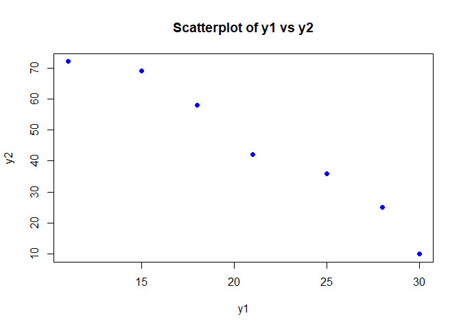
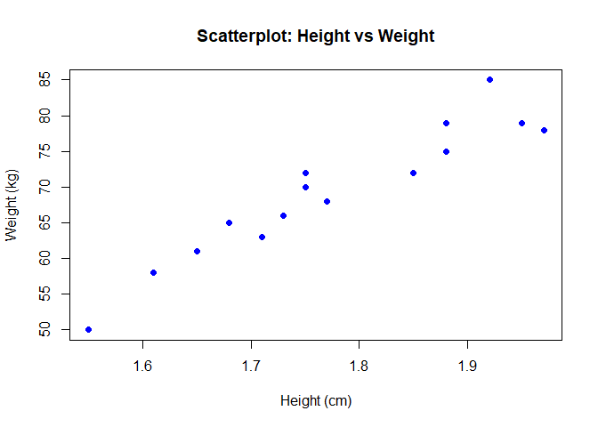
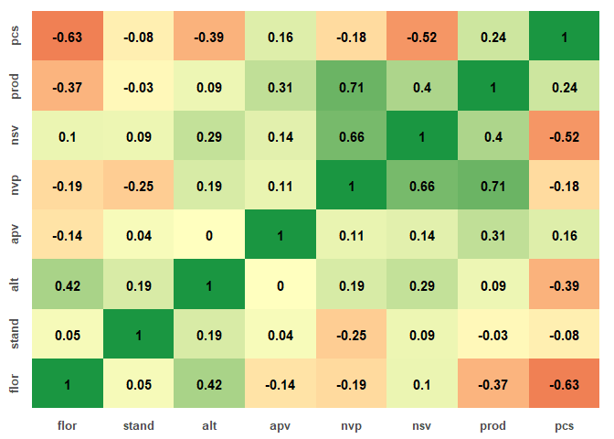
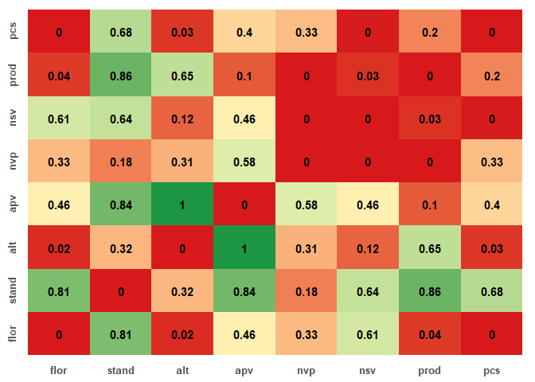

Correlation
================
Hernandes Peres

- [Correlation](#correlation)
  - [Example 1:](#example-1)
  - [Example 2:](#example-2)
    - [2.1 Descriptive statistics](#21-descriptive-statistics)
  - [Example 3:](#example-3)

# Correlation

## Example 1:

``` r
library(dplyr)
rm(list = ls())
data <- read.table("DataTemperatura.txt", header = TRUE)
```

Descriptive statistics

``` r
var(data$y1)
```

    ## [1] 48.47619

``` r
var(data$y2)
```

    ## [1] 531.2857

``` r
cov(data$y1, data$y2)
```

    ## [1] -157.2619

``` r
data_clean <- data[, -1]
knitr::kable(data_clean, format = "html")
```

<table>
<thead>
<tr>
<th style="text-align:right;">
y1
</th>
<th style="text-align:right;">
y2
</th>
</tr>
</thead>
<tbody>
<tr>
<td style="text-align:right;">
30
</td>
<td style="text-align:right;">
10
</td>
</tr>
<tr>
<td style="text-align:right;">
28
</td>
<td style="text-align:right;">
25
</td>
</tr>
<tr>
<td style="text-align:right;">
25
</td>
<td style="text-align:right;">
36
</td>
</tr>
<tr>
<td style="text-align:right;">
21
</td>
<td style="text-align:right;">
42
</td>
</tr>
<tr>
<td style="text-align:right;">
18
</td>
<td style="text-align:right;">
58
</td>
</tr>
<tr>
<td style="text-align:right;">
15
</td>
<td style="text-align:right;">
69
</td>
</tr>
<tr>
<td style="text-align:right;">
11
</td>
<td style="text-align:right;">
72
</td>
</tr>
</tbody>
</table>

Pearson correlation matrix

``` r
knitr::kable(cor(data_clean, method = "pearson"))
```

|     |         y1 |         y2 |
|:----|-----------:|-----------:|
| y1  |  1.0000000 | -0.9799304 |
| y2  | -0.9799304 |  1.0000000 |

Hypothesis test for correlation

``` r
cor.test(data$y1, data$y2, 
         method = "pearson", 
         alternative = "two.sided")
```

    ## 
    ##  Pearson's product-moment correlation
    ## 
    ## data:  data$y1 and data$y2
    ## t = -10.992, df = 5, p-value = 0.0001084
    ## alternative hypothesis: true correlation is not equal to 0
    ## 95 percent confidence interval:
    ##  -0.9971483 -0.8657414
    ## sample estimates:
    ##        cor 
    ## -0.9799304

**Interpretation:** -$H0$ (null hypothesis): ρ = 0 (no correlation)
-$H1$ (alternative hypothesis): ρ ≠ 0 -The *p-value* indicates whether
the correlation is statistically significant.

Scatterplot

``` r
plot(data$y1, data$y2, pch = 19, col = "blue",
     xlab = "y1", ylab = "y2", main = "Scatterplot of y1 vs y2")
```

<!-- -->

## Example 2:

``` r
rm(list = ls())

data <- read.table("DataPesoAlt.txt", header = TRUE)

knitr::kable(data)
```

| indiv | peso | altura |
|------:|-----:|-------:|
|     1 |   50 |   1.55 |
|     2 |   58 |   1.61 |
|     3 |   61 |   1.65 |
|     4 |   63 |   1.71 |
|     5 |   65 |   1.68 |
|     6 |   66 |   1.73 |
|     7 |   68 |   1.77 |
|     8 |   70 |   1.75 |
|     9 |   72 |   1.85 |
|    10 |   72 |   1.75 |
|    11 |   75 |   1.88 |
|    12 |   78 |   1.97 |
|    13 |   79 |   1.88 |
|    14 |   79 |   1.95 |
|    15 |   85 |   1.92 |

### 2.1 Descriptive statistics

``` r
cov(data$peso, data$altura)
```

    ## [1] 1.115714

``` r
data_clean <- data[, -1]
```

Pearson correlation matrix

``` r
knitr::kable(cor(data_clean, method = "pearson"))
```

|        |     peso |   altura |
|:-------|---------:|---------:|
| peso   | 1.000000 | 0.946659 |
| altura | 0.946659 | 1.000000 |

Hypothesis test for Pearson correlation

``` r
cor.test(data$peso, data$altura, 
         method = "pearson", alternative = "two.sided")
```

    ## 
    ##  Pearson's product-moment correlation
    ## 
    ## data:  data$peso and data$altura
    ## t = 10.592, df = 13, p-value = 9.192e-08
    ## alternative hypothesis: true correlation is not equal to 0
    ## 95 percent confidence interval:
    ##  0.8433866 0.9824798
    ## sample estimates:
    ##      cor 
    ## 0.946659

**Hypothesis Interpretation:** - H₀ (null hypothesis): ρ = 0 (no linear
correlation) - H₁ (alternative hypothesis): ρ ≠ 0 (there is linear
correlation)

The *p-value* will determine whether the correlation is statistically
significant.

``` r
plot(data$altura, data$peso,
     pch = 19,
     col = "blue",
     xlab = "Height (cm)",
     ylab = "Weight (kg)",
     main = "Scatterplot: Height vs Weight")
```

<!-- -->

## Example 3:

``` r
remove(list = ls())

require(ExpDes.pt)

data <- read.table("DataFeijao.txt", header = TRUE)

data$gen <- factor(data$gen)
data$bloco <- factor(data$bloco)
```

ANOVA for all response Variables

``` r
col_start <- 3 # Column index where response variables start

for(i in col_start:ncol(data)) {
  cat("\n", "Response Variable:", names(data)[i], "\n")
  knitr::kable(dbc(data$gen, data$bloco, data[, i], quali = TRUE, mcomp = "sk", sigT = 0.05, sigF = 0.05))}
```

    ## 
    ##  Response Variable: flor 
    ## ------------------------------------------------------------------------
    ## Quadro da analise de variancia
    ## ------------------------------------------------------------------------
    ##            GL      SQ      QM      Fc   Pr>Fc
    ## Tratamento  9 251.467 27.9407 13.9188 0.00000
    ## Bloco       2   1.867  0.9333  0.4649 0.63551
    ## Residuo    18  36.133  2.0074                
    ## Total      29 289.467                        
    ## ------------------------------------------------------------------------
    ## CV = 3.01 %
    ## 
    ## ------------------------------------------------------------------------
    ## Teste de normalidade dos residuos 
    ## valor-p:  0.9389967 
    ## De acordo com o teste de Shapiro-Wilk a 5% de significancia, os residuos podem ser considerados normais.
    ## ------------------------------------------------------------------------
    ## 
    ## ------------------------------------------------------------------------
    ## Teste de homogeneidade de variancia 
    ## valor-p:  0.197512 
    ## De acordo com o teste de oneillmathews a 5% de significancia, as variancias podem ser consideradas homogeneas.
    ## ------------------------------------------------------------------------
    ## 
    ## Teste de Scott-Knott
    ## ------------------------------------------------------------------------
    ##    Grupos Tratamentos   Medias
    ## 1       a           2 52.00000
    ## 2       b           7 49.66667
    ## 3       b           3 49.33333
    ## 4       c           5 48.00000
    ## 5       c           1 47.66667
    ## 6       c           6 47.00000
    ## 7       c           8 46.66667
    ## 8       c          10 46.33333
    ## 9       d           4 43.00000
    ## 10      d           9 41.66667
    ## ------------------------------------------------------------------------
    ## 
    ##  Response Variable: stand 
    ## ------------------------------------------------------------------------
    ## Quadro da analise de variancia
    ## ------------------------------------------------------------------------
    ##            GL     SQ     QM     Fc   Pr>Fc
    ## Tratamento  9  698.7  77.63 0.4634 0.88044
    ## Bloco       2 1680.9 840.43 5.0162 0.01856
    ## Residuo    18 3015.8 167.54               
    ## Total      29 5395.4                      
    ## ------------------------------------------------------------------------
    ## CV = 9.56 %
    ## 
    ## ------------------------------------------------------------------------
    ## Teste de normalidade dos residuos 
    ## valor-p:  0.2619861 
    ## De acordo com o teste de Shapiro-Wilk a 5% de significancia, os residuos podem ser considerados normais.
    ## ------------------------------------------------------------------------
    ## 
    ## ------------------------------------------------------------------------
    ## Teste de homogeneidade de variancia 
    ## valor-p:  0.01876398 
    ## ATENCAO: a 5% de significancia, as variancias nao podem ser consideradas homogeneas!
    ## ------------------------------------------------------------------------
    ## 
    ## De acordo com o teste F, as medias nao podem ser consideradas diferentes.
    ##    Niveis   Medias
    ## 1       1 137.6667
    ## 2      10 141.3333
    ## 3       2 143.0000
    ## 4       3 138.0000
    ## 5       4 132.0000
    ## 6       5 126.0000
    ## 7       6 135.6667
    ## 8       7 132.0000
    ## 9       8 131.6667
    ## 10      9 137.0000
    ## ------------------------------------------------------------------------
    ## 
    ##  Response Variable: alt 
    ## ------------------------------------------------------------------------
    ## Quadro da analise de variancia
    ## ------------------------------------------------------------------------
    ##            GL     SQ     QM     Fc   Pr>Fc
    ## Tratamento  9 2049.6 227.74 1.8677 0.12397
    ## Bloco       2  421.8 210.90 1.7296 0.20556
    ## Residuo    18 2194.9 121.94               
    ## Total      29 4666.3                      
    ## ------------------------------------------------------------------------
    ## CV = 24.38 %
    ## 
    ## ------------------------------------------------------------------------
    ## Teste de normalidade dos residuos 
    ## valor-p:  0.04810931 
    ## ATENCAO: a 5% de significancia, os residuos nao podem ser considerados normais!
    ## ------------------------------------------------------------------------
    ## 
    ## ------------------------------------------------------------------------
    ## Teste de homogeneidade de variancia 
    ## valor-p:  0.07625354 
    ## De acordo com o teste de oneillmathews a 5% de significancia, as variancias podem ser consideradas homogeneas.
    ## ------------------------------------------------------------------------
    ## 
    ## De acordo com o teste F, as medias nao podem ser consideradas diferentes.
    ##    Niveis   Medias
    ## 1       1 57.00000
    ## 2      10 51.00000
    ## 3       2 43.00000
    ## 4       3 48.00000
    ## 5       4 35.33333
    ## 6       5 42.66667
    ## 7       6 45.00000
    ## 8       7 56.66667
    ## 9       8 45.33333
    ## 10      9 29.00000
    ## ------------------------------------------------------------------------
    ## 
    ##  Response Variable: apv 
    ## ------------------------------------------------------------------------
    ## Quadro da analise de variancia
    ## ------------------------------------------------------------------------
    ##            GL    SQ      QM      Fc    Pr>Fc
    ## Tratamento  9  98.8  10.978  1.3646 0.273871
    ## Bloco       2 259.2 129.600 16.1105 0.000098
    ## Residuo    18 144.8   8.044                 
    ## Total      29 502.8                         
    ## ------------------------------------------------------------------------
    ## CV = 19.16 %
    ## 
    ## ------------------------------------------------------------------------
    ## Teste de normalidade dos residuos 
    ## valor-p:  0.08840062 
    ## De acordo com o teste de Shapiro-Wilk a 5% de significancia, os residuos podem ser considerados normais.
    ## ------------------------------------------------------------------------
    ## 
    ## ------------------------------------------------------------------------
    ## Teste de homogeneidade de variancia 
    ## valor-p:  0.9140463 
    ## De acordo com o teste de oneillmathews a 5% de significancia, as variancias podem ser consideradas homogeneas.
    ## ------------------------------------------------------------------------
    ## 
    ## De acordo com o teste F, as medias nao podem ser consideradas diferentes.
    ##    Niveis   Medias
    ## 1       1 14.00000
    ## 2      10 15.00000
    ## 3       2 14.00000
    ## 4       3 15.66667
    ## 5       4 18.66667
    ## 6       5 12.00000
    ## 7       6 16.66667
    ## 8       7 14.66667
    ## 9       8 14.66667
    ## 10      9 12.66667
    ## ------------------------------------------------------------------------
    ## 
    ##  Response Variable: nvp 
    ## ------------------------------------------------------------------------
    ## Quadro da analise de variancia
    ## ------------------------------------------------------------------------
    ##            GL     SQ      QM     Fc   Pr>Fc
    ## Tratamento  9 272.31 30.2563 4.3065 0.00409
    ## Bloco       2   9.12  4.5583 0.6488 0.53447
    ## Residuo    18 126.46  7.0257               
    ## Total      29 407.89                       
    ## ------------------------------------------------------------------------
    ## CV = 34.13 %
    ## 
    ## ------------------------------------------------------------------------
    ## Teste de normalidade dos residuos 
    ## valor-p:  0.844345 
    ## De acordo com o teste de Shapiro-Wilk a 5% de significancia, os residuos podem ser considerados normais.
    ## ------------------------------------------------------------------------
    ## 
    ## ------------------------------------------------------------------------
    ## Teste de homogeneidade de variancia 
    ## valor-p:  0.5562581 
    ## De acordo com o teste de oneillmathews a 5% de significancia, as variancias podem ser consideradas homogeneas.
    ## ------------------------------------------------------------------------
    ## 
    ## Teste de Scott-Knott
    ## ------------------------------------------------------------------------
    ##    Grupos Tratamentos    Medias
    ## 1       a           5 13.566667
    ## 2       a           6 10.666667
    ## 3       a          10  9.933333
    ## 4       a           3  8.666667
    ## 5       b           8  7.833333
    ## 6       b           1  7.233333
    ## 7       b           9  6.466667
    ## 8       b           4  6.233333
    ## 9       b           7  4.766667
    ## 10      b           2  2.300000
    ## ------------------------------------------------------------------------
    ## 
    ##  Response Variable: nsv 
    ## ------------------------------------------------------------------------
    ## Quadro da analise de variancia
    ## ------------------------------------------------------------------------
    ##            GL     SQ      QM      Fc   Pr>Fc
    ## Tratamento  9 26.679 2.96430 10.2782 0.00002
    ## Bloco       2  0.189 0.09433  0.3271 0.72522
    ## Residuo    18  5.191 0.28841                
    ## Total      29 32.059                        
    ## ------------------------------------------------------------------------
    ## CV = 11.86 %
    ## 
    ## ------------------------------------------------------------------------
    ## Teste de normalidade dos residuos 
    ## valor-p:  0.2389186 
    ## De acordo com o teste de Shapiro-Wilk a 5% de significancia, os residuos podem ser considerados normais.
    ## ------------------------------------------------------------------------
    ## 
    ## ------------------------------------------------------------------------
    ## Teste de homogeneidade de variancia 
    ## valor-p:  0.7717328 
    ## De acordo com o teste de oneillmathews a 5% de significancia, as variancias podem ser consideradas homogeneas.
    ## ------------------------------------------------------------------------
    ## 
    ## Teste de Scott-Knott
    ## ------------------------------------------------------------------------
    ##    Grupos Tratamentos   Medias
    ## 1       a           3 5.866667
    ## 2       a           6 5.866667
    ## 3       a          10 5.700000
    ## 4       a           5 4.966667
    ## 5       b           1 4.200000
    ## 6       b           7 4.100000
    ## 7       b           8 4.066667
    ## 8       b           9 3.700000
    ## 9       b           4 3.466667
    ## 10      b           2 3.333333
    ## ------------------------------------------------------------------------
    ## 
    ##  Response Variable: prod 
    ## ------------------------------------------------------------------------
    ## Quadro da analise de variancia
    ## ------------------------------------------------------------------------
    ##            GL      SQ     QM     Fc   Pr>Fc
    ## Tratamento  9 1269453 141050 7.3231 0.00018
    ## Bloco       2   34101  17050 0.8852 0.42984
    ## Residuo    18  346699  19261               
    ## Total      29 1650252                      
    ## ------------------------------------------------------------------------
    ## CV = 26.69 %
    ## 
    ## ------------------------------------------------------------------------
    ## Teste de normalidade dos residuos 
    ## valor-p:  0.1361485 
    ## De acordo com o teste de Shapiro-Wilk a 5% de significancia, os residuos podem ser considerados normais.
    ## ------------------------------------------------------------------------
    ## 
    ## ------------------------------------------------------------------------
    ## Teste de homogeneidade de variancia 
    ## valor-p:  0.6319681 
    ## De acordo com o teste de oneillmathews a 5% de significancia, as variancias podem ser consideradas homogeneas.
    ## ------------------------------------------------------------------------
    ## 
    ## Teste de Scott-Knott
    ## ------------------------------------------------------------------------
    ##    Grupos Tratamentos   Medias
    ## 1       a           5 763.6667
    ## 2       a           8 732.6667
    ## 3       a           4 639.6667
    ## 4       a           1 610.6667
    ## 5       a          10 593.0000
    ## 6       a           3 589.6667
    ## 7       a           6 566.3333
    ## 8       b           9 390.6667
    ## 9       b           7 196.6667
    ## 10      b           2 117.0000
    ## ------------------------------------------------------------------------
    ## 
    ##  Response Variable: pcs 
    ## ------------------------------------------------------------------------
    ## Quadro da analise de variancia
    ## ------------------------------------------------------------------------
    ##            GL     SQ     QM      Fc   Pr>Fc
    ## Tratamento  9 5153.4 572.60 254.907 0.00000
    ## Bloco       2   21.1  10.53   4.689 0.02295
    ## Residuo    18   40.4   2.25                
    ## Total      29 5214.9                       
    ## ------------------------------------------------------------------------
    ## CV = 6.18 %
    ## 
    ## ------------------------------------------------------------------------
    ## Teste de normalidade dos residuos 
    ## valor-p:  0.6600207 
    ## De acordo com o teste de Shapiro-Wilk a 5% de significancia, os residuos podem ser considerados normais.
    ## ------------------------------------------------------------------------
    ## 
    ## ------------------------------------------------------------------------
    ## Teste de homogeneidade de variancia 
    ## valor-p:  0.425067 
    ## De acordo com o teste de oneillmathews a 5% de significancia, as variancias podem ser consideradas homogeneas.
    ## ------------------------------------------------------------------------
    ## 
    ## Teste de Scott-Knott
    ## ------------------------------------------------------------------------
    ##    Grupos Tratamentos   Medias
    ## 1       a           4 49.66667
    ## 2       b           8 45.00000
    ## 3       c           9 36.33333
    ## 4       d           1 18.00000
    ## 5       d           2 18.00000
    ## 6       e           5 15.66667
    ## 7       e          10 15.66667
    ## 8       e           3 15.16667
    ## 9       e           7 15.00000
    ## 10      e           6 14.16667
    ## ------------------------------------------------------------------------

Correlation between productivity and 100-seed weight

``` r
cor(data$prod, data$pcs)
```

    ## [1] 0.2425899

``` r
cor.test(data$prod, data$pcs, 
         method = "pearson", 
         alternative = "two.sided", conf.level = 0.95)
```

    ## 
    ##  Pearson's product-moment correlation
    ## 
    ## data:  data$prod and data$pcs
    ## t = 1.3232, df = 28, p-value = 0.1965
    ## alternative hypothesis: true correlation is not equal to 0
    ## 95 percent confidence interval:
    ##  -0.1289492  0.5544053
    ## sample estimates:
    ##       cor 
    ## 0.2425899

Correlation matrix for all response variables

``` r
responses <- data[, -c(1, 2)] # Remove genotype and block columns
knitr::kable(responses)
```

| flor | stand | alt | apv |  nvp | nsv | prod |  pcs |
|-----:|------:|----:|----:|-----:|----:|-----:|-----:|
|   49 |   117 |  45 |  10 |  6.0 | 4.4 |  413 | 18.0 |
|   48 |   154 |  60 |  12 |  8.6 | 4.2 |  620 | 19.0 |
|   46 |   142 |  66 |  20 |  7.1 | 4.0 |  799 | 17.0 |
|   54 |   149 |  45 |  10 |  2.0 | 3.4 |  110 | 18.0 |
|   51 |   146 |  52 |  17 |  3.1 | 3.1 |  135 | 19.0 |
|   51 |   134 |  32 |  15 |  1.8 | 3.5 |  106 | 17.0 |
|   50 |   148 |  46 |  10 |  6.1 | 5.2 |  495 | 14.5 |
|   49 |   141 |  55 |  15 |  7.4 | 6.5 |  475 | 14.5 |
|   49 |   125 |  43 |  22 | 12.5 | 5.9 |  799 | 16.5 |
|   43 |    99 |  32 |  13 |  6.1 | 3.1 |  461 | 49.0 |
|   43 |   158 |  39 |  18 |  6.9 | 3.5 |  851 | 51.0 |
|   43 |   139 |  35 |  25 |  5.7 | 3.8 |  607 | 49.0 |
|   49 |   105 |  45 |  10 | 15.0 | 4.2 |  744 | 14.5 |
|   47 |   140 |  43 |  11 |  9.5 | 5.1 |  700 | 17.5 |
|   48 |   133 |  40 |  15 | 16.2 | 5.6 |  847 | 15.0 |
|   45 |   134 |  56 |  15 | 13.1 | 6.3 |  763 | 13.5 |
|   50 |   146 |  45 |  16 |  5.7 | 4.9 |  424 | 14.0 |
|   46 |   127 |  34 |  19 | 13.2 | 6.4 |  512 | 15.0 |
|   51 |   124 |  85 |  15 |  7.9 | 4.5 |  270 | 15.5 |
|   48 |   149 |  47 |  13 |  3.2 | 4.0 |  169 | 16.0 |
|   50 |   123 |  38 |  16 |  3.2 | 3.8 |  151 | 13.5 |
|   46 |   139 |  48 |  12 |  9.1 | 4.3 |  745 | 43.0 |
|   46 |   133 |  46 |  16 |  7.6 | 4.2 |  813 | 49.0 |
|   48 |   123 |  42 |  16 |  6.8 | 3.7 |  640 | 43.0 |
|   41 |   143 |  26 |   9 |  5.5 | 3.6 |  282 | 33.0 |
|   43 |   143 |  31 |  16 |  5.6 | 4.3 |  520 | 37.5 |
|   41 |   125 |  30 |  13 |  8.3 | 3.2 |  370 | 38.5 |
|   46 |   138 |  42 |   8 |  6.7 | 5.2 |  471 | 15.0 |
|   47 |   150 |  70 |  14 | 13.4 | 6.3 |  570 | 16.5 |
|   46 |   136 |  41 |  23 |  9.7 | 5.6 |  738 | 15.5 |

``` r
library(ggplot2)
library(reshape2)
r <- cor(responses)
knitr::kable(r)
```

|       |       flor |      stand |        alt |        apv |        nvp |        nsv |       prod |        pcs |
|:------|-----------:|-----------:|-----------:|-----------:|-----------:|-----------:|-----------:|-----------:|
| flor  |  1.0000000 |  0.0450237 |  0.4205771 | -0.1394488 | -0.1858683 |  0.0975097 | -0.3747223 | -0.6312454 |
| stand |  0.0450237 |  1.0000000 |  0.1881573 |  0.0386144 | -0.2495267 |  0.0878909 | -0.0342944 | -0.0792683 |
| alt   |  0.4205771 |  0.1881573 |  1.0000000 |  0.0005223 |  0.1928082 |  0.2910215 |  0.0851938 | -0.3881845 |
| apv   | -0.1394488 |  0.0386144 |  0.0005223 |  1.0000000 |  0.1053297 |  0.1390978 |  0.3067836 |  0.1609367 |
| nvp   | -0.1858683 | -0.2495267 |  0.1928082 |  0.1053297 |  1.0000000 |  0.6563671 |  0.7120437 | -0.1831283 |
| nsv   |  0.0975097 |  0.0878909 |  0.2910215 |  0.1390978 |  0.6563671 |  1.0000000 |  0.4004771 | -0.5247605 |
| prod  | -0.3747223 | -0.0342944 |  0.0851938 |  0.3067836 |  0.7120437 |  0.4004771 |  1.0000000 |  0.2425899 |
| pcs   | -0.6312454 | -0.0792683 | -0.3881845 |  0.1609367 | -0.1831283 | -0.5247605 |  0.2425899 |  1.0000000 |

``` r
r <- melt(r)

r %>% ggplot(aes(x = Var1, y = Var2, fill = value))+
  geom_tile()+
  geom_text(aes(label = round(value,2)), size = 4, 
            fontface = "bold")+
  scale_fill_gradient2(low = "#d7191c",
                      mid = "#ffffbf",
                      high = "#1a9641",
                      midpoint = 0)+
  theme_minimal()+
  theme(axis.text.x = element_text(size = 10, face = "bold", hjust = 0.5),
        axis.text.y = element_text(size = 10, face = "bold", 
                                   hjust = 0.5, angle = 90),
        axis.title = element_blank(),
        axis.ticks = element_blank(),
        panel.grid = element_blank(), 
        legend.position = "none")
```

<!-- -->

p-values for Pearson Correlation Tests

``` r
pvalue <- matrix(0, ncol(responses), ncol(responses))
colnames(pvalue) <- rownames(pvalue) <- colnames(responses)

for(i in 1:ncol(responses)) {
  for(j in 1:ncol(responses)) {
    pvalue[i, j] <- cor.test(responses[, i], responses[, j], method = "pearson")$p.value
  }
}

knitr::kable(pvalue)
```

|       |      flor |     stand |       alt |       apv |       nvp |       nsv |      prod |       pcs |
|:------|----------:|----------:|----------:|----------:|----------:|----------:|----------:|----------:|
| flor  | 0.0000000 | 0.8132417 | 0.0206559 | 0.4623759 | 0.3254164 | 0.6082221 | 0.0413259 | 0.0001837 |
| stand | 0.8132417 | 0.0000000 | 0.3193864 | 0.8394571 | 0.1835877 | 0.6441973 | 0.8572239 | 0.6771334 |
| alt   | 0.0206559 | 0.3193864 | 0.0000000 | 0.9978145 | 0.3073495 | 0.1187011 | 0.6544324 | 0.0340267 |
| apv   | 0.4623759 | 0.8394571 | 0.9978145 | 0.0000000 | 0.5796162 | 0.4635143 | 0.0991557 | 0.3955535 |
| nvp   | 0.3254164 | 0.1835877 | 0.3073495 | 0.5796162 | 0.0000000 | 0.0000819 | 0.0000102 | 0.3327254 |
| nsv   | 0.6082221 | 0.6441973 | 0.1187011 | 0.4635143 | 0.0000819 | 0.0000000 | 0.0283067 | 0.0029093 |
| prod  | 0.0413259 | 0.8572239 | 0.6544324 | 0.0991557 | 0.0000102 | 0.0283067 | 0.0000000 | 0.1964764 |
| pcs   | 0.0001837 | 0.6771334 | 0.0340267 | 0.3955535 | 0.3327254 | 0.0029093 | 0.1964764 | 0.0000000 |

``` r
pvalue <- melt(pvalue)
```

``` r
pvalue %>% ggplot(aes(x = Var1, y = Var2, fill = value))+
  geom_tile()+
  geom_text(aes(label = round(value,2)), size = 4, 
            fontface = "bold")+
  scale_fill_gradient2(low = "#d7191c",
                      mid = "#ffffbf",
                      high = "#1a9641",
                      midpoint = 0.5)+
  theme_minimal()+
  theme(axis.text.x = element_text(size = 10, face = "bold", hjust = 0.5),
        axis.text.y = element_text(size = 10, face = "bold", 
                                   hjust = 0.5, angle = 90),
        axis.title = element_blank(),
        axis.ticks = element_blank(),
        panel.grid = element_blank(), 
        legend.position = "none")
```

<!-- -->
